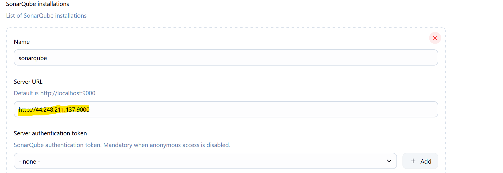

# CI/CD Pipeline with Jenkins and Ansible

A complete CI/CD pipeline implementation using Jenkins for continuous integration and Ansible for automated deployment, featuring SonarQube code analysis and JFrog Artifactory for artifact management.

## Architecture Overview

This project demonstrates a full DevOps pipeline that includes:
- **Jenkins** - CI/CD orchestration and build automation
- **Ansible** - Configuration management and deployment automation
- **SonarQube** - Static code analysis and quality gates
- **JFrog Artifactory** - Artifact repository management
- **GitHub** - Source code management with webhooks
- **Nginx** - Web server deployment

## Prerequisites

- AWS EC2 instances or equivalent servers
- GitHub repository with appropriate access tokens
- Basic understanding of Jenkins, Ansible, and DevOps practices

## Project Setup and Implementation

### Step 1: Project Structure Setup

Create the proper Ansible project structure with roles and configurations.

**Commands:**
```bash
# Create project directory
mkdir ci-cd-pipeline
cd ci-cd-pipeline
```

```bash
# Create Ansible directory structure
mkdir -p roles/nginx/tasks
mkdir -p roles/nginx/handlers
mkdir -p roles/nginx/templates
mkdir -p roles/nginx/files
mkdir group_vars
mkdir inventory
```

```bash
# Create main playbook
touch site.yml
touch inventory/hosts
touch group_vars/all.yml
```


### Step 2: GitHub Integration

#### 2.1 Generate GitHub Access Token
Create a personal access token for Jenkins to access your repository.

**Steps:**
1. Go to GitHub → Settings → Developer settings → Personal access tokens
2. Click "Generate new token (classic)"
3. Select scopes: `repo`, `admin:repo_hook`
4. Copy the generated token


#### 2.2 Configure Group Variables
Set up the group variables file for Ansible inventory management.

**Commands:**
```bash
# Edit group variables
vim group_vars/all.yml
```

**Content for group_vars/all.yml:**
```yaml
---
ansible_user: ubuntu
ansible_ssh_private_key_file: ~/.ssh/your-key.pem
ansible_ssh_common_args: '-o StrictHostKeyChecking=no'
```


#### 2.3 Create Jenkinsfile
Add the pipeline configuration file to your repository.

**Commands:**
```bash
# Create Jenkinsfile
touch Jenkinsfile
```

```bash
# Edit Jenkinsfile
vim Jenkinsfile
```


### Step 3: Infrastructure Verification

#### 3.1 Server Connectivity Test
Verify all servers are reachable via Ansible ping module.

**Commands:**
```bash
# Test connectivity to all servers
ansible all -i inventory/hosts -m ping
```

```bash
# Test specific group
ansible webservers -i inventory/hosts -m ping
```

```bash
# Verbose output
ansible all -i inventory/hosts -m ping -v
```

**Sample inventory/hosts file:**
```ini
[webservers]
web1 ansible_host=10.0.1.10
web2 ansible_host=10.0.1.11

[jenkins]
jenkins ansible_host=10.0.1.20

[sonarqube]
sonar ansible_host=10.0.1.30
```


### Step 4: Artifactory Setup

#### 4.1 Install JFrog Artifactory
Deploy and configure the artifact repository manager.

**Commands:**
```bash
# Download and install Artifactory
wget -qO - https://releases.jfrog.io/artifactory/api/gpg/key/public | sudo apt-key add -
```

```bash
echo "deb https://releases.jfrog.io/artifactory/artifactory-debs xenial main" | sudo tee /etc/apt/sources.list.d/artifactory.list
```

```bash
sudo apt update
sudo apt install jfrog-artifactory-oss
```

```bash
# Start Artifactory service
sudo systemctl start artifactory
sudo systemctl enable artifactory
```


#### 4.2 Verify Artifactory Service
Ensure Artifactory is running and accessible.

**Commands:**
```bash
# Check service status
sudo systemctl status artifactory
```

```bash
# Check if port is listening
sudo netstat -tlnp | grep 8082
```

```bash
# Access Artifactory web UI
curl -I http://localhost:8082/artifactory
```

**Default Access:**
- URL: `http://your-server:8082/artifactory`
- Username: `admin`
- Password: `password`


### Step 5: SonarQube Configuration

#### 5.1 SonarQube Security Group
Configure AWS security group for SonarQube access.

**AWS CLI Commands:**
```bash
# Create security group
aws ec2 create-security-group --group-name sonarqube-sg --description "SonarQube Security Group"
```

```bash
# Add inbound rules
aws ec2 authorize-security-group-ingress --group-name sonarqube-sg --protocol tcp --port 9000 --cidr 0.0.0.0/0
aws ec2 authorize-security-group-ingress --group-name sonarqube-sg --protocol tcp --port 22 --cidr 0.0.0.0/0
```


#### 5.2 SonarQube Installation and Setup
Install and configure SonarQube server.

**Commands:**
```bash
# Install Java (required for SonarQube)
sudo apt update
sudo apt install openjdk-11-jdk -y
```

```bash
# Download and install SonarQube
wget https://binaries.sonarsource.com/Distribution/sonarqube/sonarqube-9.9.0.65466.zip
unzip sonarqube-9.9.0.65466.zip
sudo mv sonarqube-9.9.0.65466 /opt/sonarqube
```

```bash
# Create sonar user
sudo useradd -r -s /bin/false sonar
sudo chown -R sonar:sonar /opt/sonarqube
```

```bash
# Start SonarQube
sudo -u sonar /opt/sonarqube/bin/linux-x86-64/sonar.sh start
```


#### 5.3 Generate SonarQube Token
Create authentication token for Jenkins integration.

**Steps:**
1. Access SonarQube: `http://your-server:9000`
2. Login with admin/admin
3. Go to Administration → Security → Users
4. Click on Tokens for admin user
5. Generate new token
6. Copy the token value


### Step 6: Jenkins Configuration

#### 6.1 Jenkins Installation
Install Jenkins on your server.

**Commands:**
```bash
# Install Java
sudo apt update
sudo apt install openjdk-11-jdk -y
```

```bash
# Add Jenkins repository
wget -q -O - https://pkg.jenkins.io/debian/jenkins.io.key | sudo apt-key add -
```

```bash
sudo sh -c 'echo deb http://pkg.jenkins.io/debian-stable binary/ > /etc/apt/sources.list.d/jenkins.list'
```

```bash
# Install Jenkins
sudo apt update
sudo apt install jenkins -y
```

```bash
# Start Jenkins
sudo systemctl start jenkins
sudo systemctl enable jenkins
```

```bash
# Get initial admin password
sudo cat /var/lib/jenkins/secrets/initialAdminPassword
```

#### 6.2 SonarQube Credentials Setup
Configure SonarQube credentials in Jenkins.

**Steps:**
1. Go to Jenkins → Manage Jenkins → Manage Credentials
2. Click "Global" → "Add Credentials"
3. Kind: "Secret text"
4. Secret: [Your SonarQube token]
5. ID: "sonarqube-token"
6. Description: "SonarQube Authentication Token"



#### 6.3 Add SonarQube Token
Integrate the SonarQube token into Jenkins.

**Steps:**
1. Install SonarQube Scanner plugin
2. Go to Manage Jenkins → Configure System
3. Find "SonarQube servers" section
4. Add SonarQube server with URL and token


#### 6.4 Update Jenkinsfile for SonarQube
Modify the pipeline to include SonarQube analysis.

**Sample Jenkinsfile:**
```groovy
pipeline {
    agent any
    
    stages {
        stage('Checkout') {
            steps {
                git 'https://github.com/anyanpee/CI-CD-with-Jenkins-Sonarqube-Php-Ansible-Artifactory.git'
            }
        }
        
        stage('SonarQube Analysis') {
            steps {
                withSonarQubeEnv('SonarQube') {
                    sh 'sonar-scanner'
                }
            }
        }
        
        stage('Deploy') {
            steps {
                sh 'ansible-playbook -i inventory/hosts site.yml'
            }
        }
    }
}
```


### Step 7: Webhook Configuration

Set up GitHub webhook for automatic pipeline triggers.

**Steps:**
1. Go to your GitHub repository
2. Settings → Webhooks → Add webhook
3. Payload URL: `http://your-jenkins-server:8080/github-webhook/`
4. Content type: `application/json`
5. Events: "Just the push event"
6. Active: ✓

**Jenkins Configuration:**
1. In your Jenkins job → Configure
2. Build Triggers → "GitHub hook trigger for GITScm polling"


### Step 8: Blue Ocean Setup

Configure Jenkins Blue Ocean for enhanced pipeline visualization.

**Steps:**
1. Install Blue Ocean plugin in Jenkins
2. Go to Manage Jenkins → Manage Plugins
3. Search for "Blue Ocean" and install
4. Restart Jenkins
5. Access Blue Ocean: `http://your-jenkins:8080/blue`

**Commands to install via CLI:**
```bash
# Install Blue Ocean plugin
java -jar jenkins-cli.jar -s http://localhost:8080/ install-plugin blueocean
```


### Step 9: Pipeline Execution

#### 9.1 Initial Build Success
Execute the first successful Jenkins build.

**Commands:**
```bash
# Trigger build manually
curl -X POST http://your-jenkins:8080/job/your-pipeline/build --user admin:your-token
```

```bash
# Or trigger via git push
git add .
git commit -m "Initial pipeline setup"
git push origin main
```


#### 9.2 Pipeline Deployment Success
Complete pipeline execution in Jenkins.

**Monitor build:**
```bash
# Check build status
curl http://your-jenkins:8080/job/your-pipeline/lastBuild/api/json
```

```bash
# View console output
curl http://your-jenkins:8080/job/your-pipeline/lastBuild/consoleText
```


#### 9.3 Blue Ocean Deployment Success
View successful deployment in Blue Ocean interface.

**Access Blue Ocean:**
- URL: `http://your-jenkins:8080/blue/organizations/jenkins/your-pipeline/activity`


### Step 10: Code Quality Analysis

#### 10.1 SonarQube Analysis Results
Review code quality metrics and analysis results.

**Commands to check analysis:**
```bash
# Check SonarQube project status
curl -u admin:admin "http://your-sonarqube:9000/api/projects/search"
```

```bash
# Get quality gate status
curl -u admin:admin "http://your-sonarqube:9000/api/qualitygates/project_status?projectKey=your-project"
```

**Access SonarQube Dashboard:**
- URL: `http://your-sonarqube:9000/dashboard?id=your-project`


### Step 11: Ansible Deployment

#### 11.1 Dependencies Deployment
Deploy application dependencies using Ansible.

**Commands:**
```bash
# Run dependency installation playbook
ansible-playbook -i inventory/hosts dependencies.yml -v
```

```bash
# Install specific packages
ansible webservers -i inventory/hosts -m apt -a "name=php state=present" --become
ansible webservers -i inventory/hosts -m apt -a "name=php-fpm state=present" --become
```

**Sample dependencies.yml:**
```yaml
---
- hosts: webservers
  become: yes
  tasks:
    - name: Update apt cache
      apt:
        update_cache: yes
    
    - name: Install PHP and dependencies
      apt:
        name:
          - php
          - php-fpm
          - php-mysql
        state: present
```


#### 11.2 Nginx Deployment Success
Successfully deploy and configure Nginx web server.

**Commands:**
```bash
# Run Nginx deployment
ansible-playbook -i inventory/hosts site.yml --tags nginx -v
```

```bash
# Test Nginx configuration
ansible webservers -i inventory/hosts -m shell -a "nginx -t" --become
```

```bash
# Restart Nginx service
ansible webservers -i inventory/hosts -m service -a "name=nginx state=restarted" --become
```


### Step 12: Application Verification

Verify the deployed PHP application is accessible.

**Commands:**
```bash
# Test web server response
curl -I http://your-web-server
```

```bash
# Test PHP functionality
curl http://your-web-server/info.php
```

```bash
# Check server status
ansible webservers -i inventory/hosts -m uri -a "url=http://localhost return_content=yes"
```

```bash
# Verify Nginx is serving content
ansible webservers -i inventory/hosts -m shell -a "systemctl status nginx"
```

**Create test PHP file:**
```bash
# Create info.php for testing
echo "<?php phpinfo(); ?>" | sudo tee /var/www/html/info.php
```


### Step 13: Pull Request Workflow

Demonstrate the complete GitOps workflow with pull requests.

**Commands:**
```bash
# Create feature branch
git checkout -b feature/new-deployment
```

```bash
# Make changes
echo "# New feature" >> README.md
git add README.md
git commit -m "Add new feature documentation"
```

```bash
# Push feature branch
git push origin feature/new-deployment
```

```bash
# Create pull request (via GitHub CLI)
gh pr create --title "Add new feature" --body "This PR adds new deployment features"
```

```bash
# Merge pull request
gh pr merge --merge
```

**GitHub Web Interface:**
1. Go to your repository on GitHub
2. Click "Compare & pull request"
3. Add title and description
4. Click "Create pull request"
5. Review and merge


## Key Features

- **Automated CI/CD Pipeline**: Complete automation from code commit to deployment
- **Code Quality Gates**: SonarQube integration for code analysis
- **Artifact Management**: JFrog Artifactory for build artifacts
- **Infrastructure as Code**: Ansible playbooks for consistent deployments
- **Webhook Integration**: Automatic pipeline triggers on code changes
- **Blue Ocean UI**: Enhanced pipeline visualization and monitoring

## Technologies Used

- **Jenkins**: CI/CD orchestration
- **Ansible**: Configuration management
- **SonarQube**: Static code analysis
- **JFrog Artifactory**: Artifact repository
- **GitHub**: Source code management
- **AWS EC2**: Cloud infrastructure
- **Nginx**: Web server
- **PHP**: Application runtime

## Project Structure

```
CI-CD-with-Jenkins-Sonarqube-Php-Ansible-Artifactory/
├── roles/
│   └── nginx/
│       └── tasks/
│           └── main.yml
├── group_vars/
├── inventories/
├── screenshots/
├── Jenkinsfile
└── README.md
```

## Getting Started

1. Clone this repository
2. Configure your AWS infrastructure
3. Set up Jenkins with required plugins
4. Configure SonarQube and Artifactory
5. Update inventory files with your server details
6. Run the pipeline

## Quick Setup Commands

**Complete setup in one go:**
```bash
# Clone and setup project
git clone https://github.com/anyanpee/CI-CD-with-Jenkins-Sonarqube-Php-Ansible-Artifactory.git
cd CI-CD-with-Jenkins-Sonarqube-Php-Ansible-Artifactory
```

```bash
# Create directory structure
mkdir -p roles/nginx/{tasks,handlers,templates,files} group_vars inventory
```

```bash
# Create essential files
touch site.yml inventory/hosts group_vars/all.yml Jenkinsfile
```

## Contributing

1. Fork the repository
2. Create a feature branch
3. Make your changes
4. Submit a pull request
5. Ensure all quality gates pass

## License

This project is licensed under the MIT License.

---

**Author:** Peter Anyankpele